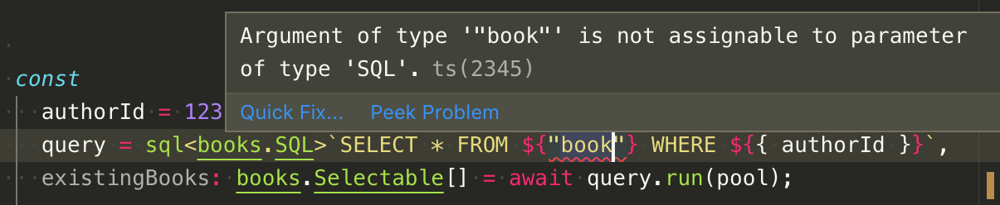
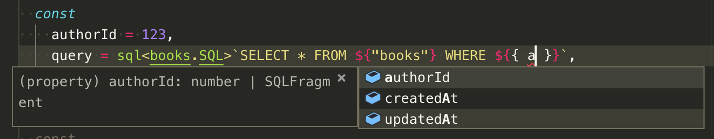
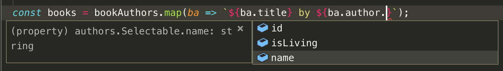
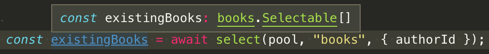
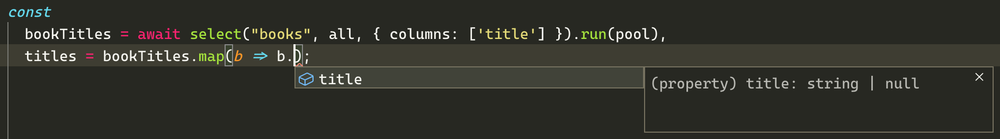
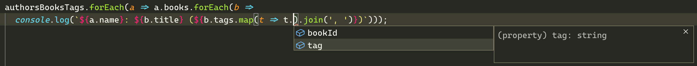
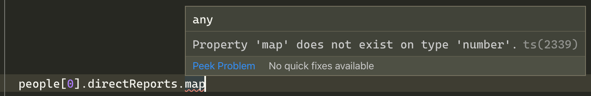

Mostly ORMless: ergonomic Postgres from TypeScript
==

_June 2019: I gave [a very brief outline of this on HN](https://news.ycombinator.com/item?id=19853066) and a few people sounded interested, so here goes. It's extracted from my work as co-founder/CTO at [PSYT](https://www.psyt.co.uk)._

_March 2020: I've updated this write-up to explain a big new feature: nested `select` helper queries, which compile to `LATERAL` joins and return fully-typed JSON structures._

---

TypeScript and VS Code are [wonderful](https://stackoverflow.com/questions/12694530/what-is-typescript-and-why-would-i-use-it-in-place-of-javascript/35048303#35048303). ORMs are [problematic](https://en.wikipedia.org/wiki/Object-relational_impedance_mismatch). 

Using an ORM within TypeScript can be particularly aggravating, since you can find yourself specifying lots of type information twice over (once to define the database schema, and once to define the associated TypeScript types).

That's why, in the course of converting a project to TypeScript recently, I decided to switch it from [Sequelize](http://docs.sequelizejs.com/) to [TypeORM](https://typeorm.io). The first day was wonderful: shiny TypeScript toys! The rest of the week was less so: perhaps even more than other ORMs, TypeORM just doesn't seem to _get_ SQL.

So, let's back up a bit. What am I really after?

Well, I understand and appreciate SQL. I understand and appreciate Postgres. I don't need or want any sort of abstraction layer on top. When I'm working with data, I want a clear mental model of what SQL commands are going to be run. I don't at all mind writing the SQL myself, but in that case let me _write_ the SQL, not deal with the endless chained method calls of a 'query builder'.

Also, I'm greedy. I want all that, but I want to keep all the type-checking goodness of TypeScript — speeding development, preventing bugs, simplifying refactoring — too. And I'd _strongly_ prefer not to spend hours laboriously adding and later maintaining lots of type information to facilitate it.

In short, I want [cake](https://www.theguardian.com/books/2018/jul/05/word-of-the-week-cake). So I set out to see if I could rustle some up. Initially a week-long project in [three acts](https://en.wikipedia.org/wiki/Three-act_structure), it has now extended into a [trilogy in five parts](https://www.goodreads.com/book/show/372299.The_Hitch_Hiker_s_Guide_to_the_Galaxy):

* _[Part 1](#act1): In which we automatically translate a Postgres DB schema into TypeScript types._ Spoiler: we'll fork a project called [schemats](https://github.com/SweetIQ/schemats) here.
* _[Part 2](#act2): In which we significantly expand that type information, and use it to improve the ergonomics of writing raw SQL._ Spoiler: ES2015 [tagged templates](https://developer.mozilla.org/en-US/docs/Web/JavaScript/Reference/Template_literals#Tagged_templates) will play a starring role.
* _[Part 3](#act3): In which we create a set of simple shortcut functions on top (which bear a passing resemblance to an ORM, but really aren't one)._ Spoiler: Typescript [function signature overloads](https://www.typescriptlang.org/docs/handbook/functions.html) on concrete string values will be these functions' secret sauce.
* _[Part 4](#act4): In which we extend our `select` shortcut function to allow nested queries._ Spoiler: nested queries become `LATERAL` joins, and the results are still fully typed. (This Part is new for March 2020).
* _[Part 5](#act5): In which we deal with transactions._

<a name="act1"></a>In which we automatically translate a Postgres DB schema into TypeScript types
--

If you want type information that matches a database schema, you have two ways to maintain a [single source of truth](https://en.wikipedia.org/wiki/Single_source_of_truth). 

On the one hand, you can define a schema in TypeScript (or JavaScript), then automagically issue database commands to sync up the tables and columns. That's the approach taken by both Sequelize and TypeScript. This approach helps manage schema updates across multiple databases (e.g. test, staging, production). But I've always been a bit leery of it: I'm not sure I want any code, let alone a third party npm library, issuing `CREATE`/`ALTER`/`DROP TABLE` statements at will where production data may be involved.

On the other hand, you can take the database schema as your source of truth, then interrogate it to discover the tables and column types. This is what [Active Record](https://guides.rubyonrails.org/active_record_basics.html) does (or at least, what it did when I last used it, about 10 years ago), and what I'm going to do here. This approach leaves you with the job of managing schema updates across multiple databases, which is not something I'll address here, but standalone tools for this purpose do exist (e.g. [dbmate](https://github.com/amacneil/dbmate)).

Active Record interrogates the database at runtime, but I'm going to do it prior to runtime: discovering types only at runtime would be largely pointless, since what we want is type information to ease _development_.

As it happens, there's already a library that can do most of the heavy lifting we need. It's named [schemats](https://github.com/SweetIQ/schemats).

How does it work? Well, take this simple database schema:

```sql
CREATE TABLE authors 
( "id" SERIAL PRIMARY KEY
, "name" TEXT NOT NULL
, "isLiving" BOOLEAN
);

CREATE TABLE books 
( "id" SERIAL PRIMARY KEY
, "authorId" INTEGER NOT NULL REFERENCES "authors"("id")
, "title" TEXT
, "createdAt" TIMESTAMPTZ NOT NULL DEFAULT now()
, "updatedAt" TIMESTAMPTZ NOT NULL DEFAULT now()
);
```

If we run vanilla schemats against this, we get the following TypeScript definitions for the `books` table:

```typescript
export namespace booksFields {
    export type id = number;
    export type authorId = number;
    export type title = string | null;
    export type createdAt = Date;
    export type updatedAt = Date;
}

export interface books {
    id: booksFields.id;
    authorId: booksFields.authorId;
    title: booksFields.title;
    createdAt: booksFields.createdAt;
    updatedAt: booksFields.updatedAt;
}
```
This is a helpful description of what you might get back from a `SELECT` query, and we can use it as follows

First, some housekeeping — we set up a connection pool:

```typescript
import * as pg from "pg";
const pool = new pg.Pool({ /* connection options */ });
```

Then:

```typescript
const
  authorId = 123,  // in production this could be untrusted input
  result = await pool.query({
    text: 'SELECT * FROM "books" WHERE "authorId" = $1',
    values: [authorId],
  }),
  existingBooks: books[] = result.rows;
```

Our results now pop out fully typed. But there are still some annoyances here:

* There's nothing to stop me absent-mindedly or fat-fingeredly trying to query from the non-existent tables `"novels"` or `"boks"`, or according to the non-existent columns `"writerId"` or `"authorid"`, or indeed trying to equate my `"authorId"` with a string or date. There's no auto-complete to help me out, and any errors (whether introduced now or by a future schema update) will only become apparent at runtime.
* I have to keep track of the order of interpolated parameters, and provide them separately from the query text. That's only `authorId` in this instance, but there could be dozens.
* Things are even worse for `INSERT`s and `UPDATE`s, where I need to generate separate, matching-ordered lists of column names and their corresponding values.

So, here's the plan. I'm going to come up with some ES2015 [tagged templates](https://developer.mozilla.org/en-US/docs/Web/JavaScript/Reference/Template_literals#Tagged_templates) to improve these SQL-writing ergonomics in TypeScript. But first, to support that, I'm going to need some more complete type information about my tables.

<a name="act2"></a>Part 2: In which we significantly expand that type information, and use it to improve the ergonomics of writing raw SQL
--

I said I wanted more complete type information about my tables. Specifically, I want the types I generate to specify not just what I'll get back from a `SELECT` query, but also what I'm allowed to use in a `WHERE` condition, and what I can `INSERT` and `UPDATE` too.

So these are the four main interfaces I'm going to define:

* **`Selectable`**: what I'll get back from a `SELECT` query. This is what schemats was already giving us.
* **`Whereable`**: what I can use in a `WHERE` condition. This is approximately the same as `Selectable`, but all columns are optional. It is (subject to some later tweaks) a `Partial<Selectable>`.
* **`Insertable`**: what I can `INSERT` into a table. This is also similar to `Selectable`, but any fields that are `NULL`able and/or have `DEFAULT` values are allowed to be missing or `NULL` or `DEFAULT`.
* **`Updatable`**: what I can `UPDATE` a row with. This is similar to what I can `INSERT`, but all columns are optional: it's a simple `Partial<Insertable>`.

I [forked schemats](https://github.com/PSYT/schemats) to generate these interfaces. While I was at it, I also got rid of the verbose, two-stage output, where a type alias is created for every column.

Ignoring some additional bells and whistles, my fork therefore now generates something like the following when run against the `books` table:

```typescript
export namespace books {

  export interface Selectable {
      id: number;
      authorId: number;
      title: string | null;
      createdAt: Date;
      updatedAt: Date;
  }

  export type Whereable = Partial<Selectable>;

  export interface Insertable {
      id?: number | DefaultType;
      authorId: number;
      title?: string | null | DefaultType;
      createdAt?: Date | DefaultType;
      updatedAt?: Date | DefaultType;
  }

  export type Updatable = Partial<Insertable>;
}

export const Default = Symbol('DEFAULT');
export type DefaultType = typeof Default;
```

If I'm querying that table, I now type the returned rows as `books.Selectable[]` instead of just `books[]`:

```typescript
const existingBooks: books.Selectable[] = /* database query goes here */;
```

And if I have an object with data that I plan to insert into the `books` table, or that I plan to use to look up a particular book, I can now also have that type-checked and auto-completed in VS Code, like so:

```typescript
const newBook: books.Insertable = { 
  authorId: 123,
  title: "One Hundred Years of Solitude",
};

const bookConditions: books.Whereable = {
  authorId: 456,
};
```

But how am I going to use these extra types? Enter the [tagged templates](https://developer.mozilla.org/en-US/docs/Web/JavaScript/Reference/Template_literals#Tagged_templates) I mentioned earlier.

Tagged templates are pleasingly flexible. Notably, neither a template's interpolated values nor its return value have to be strings. And TypeScript supports tagged templates fully, applying the tag function's signature to the interpolated values.

This is useful because:

* I'm going to define a typed tagged template function, `sql`, which we'll use to write queries. 
* It's going to be generic, so I can tell it which table(s) it targets: e.g. `sql<books.SQL>` ``` `-- database query goes here` ```
* It's not going to return a string (yet), but an instance of a class I'm going to call `SQLFragment`.
* Different kinds of interpolated values will be processed in different ways, and they'll be type-checked and auto-completed appropriately.
* An important kind of interpolated value is other `SQLFragment`s.
* When it comes to issuing the query, the root `SQLFragment` will be compiled recursively to produce the appropriate `{ text: '', values: [] }` object that can be passed on to `pg`.

It's still going to be possible to write invalid SQL, of course, but a bunch of simple errors (including most of the errors that could be introduced by future refactorings or schema changes) will be caught at edit- or compile-time.

**`SELECT`**

How does this look in practice? Well, the simple query above ends up looking like this:

```typescript
const 
  authorId = 123,
  query = sql<books.SQL>`SELECT * FROM ${"books"} WHERE ${{ authorId }}`,
  existingBooks: books.Selectable[] = await query.run(pool);
```

What's happening here? 

Well, first, the table name is now being interpolated. That means it will be type checked and auto-completed. And _that_ means: I can pick it from a list; if I get it wrong, I'll be told so immediately; and if I later change its name in the database but forget to change it here, I'll be told so too.



So the first kind of interpolated value my `sql` template tag function supports is a plain string. This is type-checked/auto-completed to correspond to a valid table or column name. It will be double-quoted in the generated raw SQL, to protect any idiomatic JavaScript/TypeScript camelCased column names.

And, second, the object I've passed as my `WHERE` clause is being type-checked/auto-completed as the appropriate `books.Whereable` type. It will be compiled to `("authorId" = $1)`, and its value will be inserted at the appropriate index of the pg query `values` array.



So the second kind of interpolated value I can use in a `sql` template is a plain object. This is type-checked/auto-completed as an appropriate `Whereable`, and compiled to a set of `WHERE` conditions connected with `AND`s.

These `Whereable` objects in fact have more flexibility than I let on before, since they also accept `SQLFragment` values. For example, what if I want to see only books for a particular author that were added during the last _N_ days? 

Then I can write the following:

```typescript
const
  authorId = 123,
  days = 7,

  query = sql<books.SQL>`
    SELECT * FROM ${"books"} 
    WHERE ${{
      authorId,
      createdAt: sql<books.SQL>`
        ${self} > now() - ${param(days)} * INTERVAL '1 DAY'`,
    }}`;
```

And to confirm how this is compiled:

```typescript
> console.log(query.compile());

{ text: 'SELECT * FROM "books" WHERE ("authorId" = $1 AND ("createdAt" > now() - $2 * INTERVAL \'1 DAY\'))',
  values: [ 123, 7 ] }
```

You can see the `SQLFragment` nested inside the `Whereable`. You can also see a symbol I've called `self`, which gets compiled to its parent column name. Finally, I'm using a wrapper function I've called `param`, which lets me manually insert parameters to be represented as `$1`, `$2` (etc.) and added to the pg query's `values` array.

**`INSERT` and `UPDATE`**

There are some additional supported interpolation types that can help with `INSERT` and `UPDATE` queries. For example, what if I wanted to save the `Insertable` object I showed you before? 

I can write:

```typescript
const 
  newBook: books.Insertable = { 
    authorId: 123,
    title: "One Hundred Years of Solitude",
  },
  query = sql<books.SQL>`
    INSERT INTO ${"books"} (${cols(newBook)})
    VALUES (${vals(newBook)})`;
```

And this gives the expected:

```typescript
> console.log(query.compile());

{ text: 'INSERT INTO "books" ("authorId", "title") VALUES ($1, $2)',
  values: [ 123, 'One Hundred Years of Solitude' ] }
```

The `cols` and `vals` wrapper functions ultimately produce identically-ordered sequences of the object's keys (quoted) and values (safely passed via pg's `values` array) respectively.

And, of course, this is all being type-checked and auto-completed as I type it:


And if, for example, someone renames the `title` column to `name` in future, VS Code will complain before I even try to run the code.

For further flexibility, there are three further kinds of interpolated value that are supported in a `sql` template. They are:

* The `Default` symbol I mentioned earlier, compiling to the `DEFAULT` keyword.
* `raw()` — as in `raw(name)`, where `name` is `"Robert'); -- DROP TABLE Students; --"` ([XKCD](https://www.xkcd.com/327/)) — for times when you really know what you're doing.
* Arrays containing any of the other supported interpolation types, whose compiled results are simply concatenated together.

Some of this relies on a few further types that I tweaked schemats to generate too:

```typescript
export namespace books {

  /* ... Selectable, Whereable, Insertable, Updatable, mostly as before,
    but all except Selectable now also allow SQLFragment values ... */

  export type Table = "books";
  export type Column = keyof Selectable;

  export type SQLExpression = GenericSQLExpression | Table | Whereable | Column | ColumnNames<Updatable> | ColumnValues<Updatable>;

  // all building up to the books.SQL type we saw above:
  export type SQL = SQLExpression | SQLExpression[];
}

// these are mostly the types of symbols or wrapper classes (not shown)
export type GenericSQLExpression = SQLFragment | Parameter | DefaultType | DangerousRawString | SelfType;  
```

**`JOIN`s**

We can of course use all of these types to help us in more complicated queries too. Take this `JOIN`, for example, retrieving each book with its (single) author. We can use Postgres's excellent JSON support to produce a sensibly-structured return value and avoid column name clashes:

```typescript
type bookAuthorSQL = books.SQL | authors.SQL | "author";
type bookAuthorSelectable = books.Selectable & { author: authors.Selectable };

const query = sql<bookAuthorSQL>`
  SELECT ${"books"}.*, to_jsonb(${"authors"}.*) as ${"author"}
  FROM ${"books"} JOIN ${"authors"} 
    ON ${"books"}.${"authorId"} = ${"authors"}.${"id"}`;

const bookAuthors: bookAuthorSelectable[] = await query.run(pool);
```

Producing:

```typescript
> console.log(bookAuthors[0]);

{
  "id": 14,
  "authorId": 123,
  "title": "One Hundred Years of Solitude",
  "createdAt": "2019-06-11T14:52:30.291Z",
  "updatedAt": "2019-06-11T14:52:30.291Z",
  "author": {
    "id": 123,
    "name": "Gabriel Garcia Marquez",
    "isLiving": false
  }
}
```

In which everything is appropriately typed:



Of course, we might also want the converse query, retrieving each author with their (many) books. This is also easy enough to arrange:

```typescript
type authorBooksSQL = authors.SQL | books.SQL;
type authorBooksSelectable = authors.Selectable & { books: books.Selectable[] };

const
  query = sql<authorBooksSQL>`
    SELECT ${"authors"}.*, jsonb_agg(${"books"}.*) AS ${"books"}
    FROM ${"authors"} JOIN ${"books"} 
      ON ${"authors"}.${"id"} = ${"books"}.${"authorId"}
    GROUP BY ${"authors"}.${"id"}`,
  authorBooks: authorBooksSelectable[] = await query.run(pool);
```

Which gives:

```typescript
> console.dir(authorBooks[0]);

[ { id: 123,
    name: 'Gabriel Garcia Marquez',
    isLiving: false,
    books:
     [ { id: 139,
         title: 'Love in the Time of Cholera',
         authorId: 123,
         createdAt: '2019-09-22T19:49:32.373132+01:00',
         updatedAt: '2019-09-22T19:49:32.373132+01:00' },
       { id: 140,
         title: 'One Hundred Years of Solitude',
         authorId: 123,
         createdAt: '2019-09-22T19:49:32.380854+01:00',
         updatedAt: '2019-09-22T19:49:32.380854+01:00' } ] } ]
```

(It also demonstrates a useful SQL fact: selecting all fields in a `GROUP BY` query is [permitted as long as you're grouping by primary key](https://dba.stackexchange.com/questions/158015/why-can-i-sel)).

Note that if you want to include authors with no books, you need a `LEFT JOIN` in this query, and then you'll want to fix the annoying [`[null]` array results `jsonb_agg` will return for those authors](https://stackoverflow.com/questions/24155190/postgresql-left-join-json-agg-ignore-remove-null).

One way to do that is to define a simple function to replace `[null]` with the empty array `[]`:

```sql
CREATE OR REPLACE FUNCTION empty_nulls(jsonb) RETURNS jsonb AS $$
  SELECT CASE $1 WHEN '[null]'::jsonb THEN '[]'::jsonb ELSE $1 END
$$ LANGUAGE SQL IMMUTABLE;
```

And wrap it around the `jsonb_agg` call:

```typescript
const query = sql<authorBooksSQL>`
  SELECT ${"authors"}.*, empty_nulls(jsonb_agg(${"books"}.*)) AS ${"books"}
  FROM ${"authors"} LEFT JOIN ${"books"} 
    ON ${"authors"}.${"id"} = ${"books"}.${"authorId"}
  GROUP BY ${"authors"}.${"id"}`;
```

Alternatively, we can achieve the same result using a [`LATERAL` join](https://medium.com/kkempin/postgresqls-lateral-join-bfd6bd0199df) instead:

```typescript
const query = db.sql<authorBooksSQL>`
  SELECT ${"authors"}.*, bq.* 
  FROM ${"authors"} CROSS JOIN LATERAL (
    SELECT coalesce(json_agg(${"books"}.*), '[]') AS ${"books"}
    FROM ${"books"}
    WHERE ${"books"}.${"authorId"} = ${"authors"}.${"id"}
  ) bq`;
```
 
This approach can be extended to more complex, nested cases too. Say, for example, that we let each book have multiple tags, with the following addition to the schema:

```sql
CREATE TABLE "tags"
( "tag" TEXT NOT NULL
, "bookId" INTEGER NOT NULL REFERENCES "books"("id")
);
CREATE UNIQUE INDEX "tagsUniqueIdx" ON "tags"("bookId", "tag");
CREATE INDEX "tagsBookIdIdx" ON "tags"("tag");
```

Then we could retrieve authors, each with their books, each with its tag values, using the following screenful:

```typescript
type authorBookTagsSQL = authors.SQL | books.SQL | tags.SQL;
type authorBookTagsSelectable = authors.Selectable & {
  books: (books.Selectable & { tags: tags.Selectable['tag'] })[]
};

const query = sql<authorBookTagsSQL>`
  SELECT ${"authors"}.*, bq.*
  FROM ${"authors"} CROSS JOIN LATERAL (
    SELECT coalesce(jsonb_agg(to_jsonb(${"books"}.*) || to_jsonb(tq.*)), '[]') AS ${"books"}
    FROM ${"books"} CROSS JOIN LATERAL (
      SELECT coalesce(jsonb_agg(${"tags"}.${"tag"}), '[]') AS ${"tags"} 
      FROM ${"tags"}
      WHERE ${"tags"}.${"bookId"} = ${"books"}.${"id"}
    ) tq
    WHERE ${"books"}.${"authorId"} = ${"authors"}.${"id"}
  ) bq`;

const authorBookTags: authorBookTagsSelectable[] = await query.run(pool);
console.dir(authorBookTags, { depth: null });
```

Which gives, correctly typed:

```typescript
[ { id: 1,
    name: 'Jane Austen',
    isLiving: false,
    books:
     [ { id: 284,
         tags: [],
         title: 'Pride and Prejudice',
         authorId: 1,
         createdAt: '2019-11-04T17:06:11.209512+00:00',
         updatedAt: '2019-11-04T17:06:11.209512+00:00' } ] },
  { id: 123,
    name: 'Gabriel Garcia Marquez',
    isLiving: false,
    books:
     [ { id: 285,
         tags: [ 'Spanish', '1980s' ],
         title: 'Love in the Time of Cholera',
         authorId: 123,
         createdAt: '2019-11-04T17:06:11.209512+00:00',
         updatedAt: '2019-11-04T17:06:11.209512+00:00' },
       { id: 286,
         tags: [],
         title: 'One Hundred Years of Solitude',
         authorId: 123,
         createdAt: '2019-11-04T17:06:11.228866+00:00',
         updatedAt: '2019-11-04T17:06:11.228866+00:00' } ] },
  { id: 456, name: 'Douglas Adams', isLiving: false, books: [] } ]
```

**Field subsets**

Unless you have very wide tables and/or very large values, it might be a [premature optimization](https://softwareengineering.stackexchange.com/questions/80084/is-premature-optimization-really-the-root-of-all-evil) to query only a subset of fields. But if you need it, two conveniences are provided: (1) the `cols` function can take an array of column names, and simply spit them out quoted and comma-separated; and (2) there's a table-specific type helper `OnlyCols` that will narrow the appropriate `Selectable` down to the columns included in such an array.

For example:

```typescript
const bookCols = <const>['id', 'title'];  // <const> prevents generalization to string[]
type BookDatum = books.OnlyCols<typeof bookCols>;

const
  query = sql<books.SQL>`SELECT ${cols(bookCols)} FROM ${"books"}`,
  bookData: BookDatum[] = await query.run(pool);
```

Giving:

```typescript
> console.log(bookData);

[ { id: 153, title: 'Pride and Prejudice' },
  { id: 154, title: 'Love in the Time of Cholera' },
  { id: 155, title: 'One Hundred Years of Solitude' } ]
```

And that marks the end of Part 2. SQL queries are now being auto-completed and type-checked for me, which is excellent. But a lot of the simple stuff still feels a bit boiler-platey and verbose. And those multi-level `SELECT` queries are getting kind of long and hairy.


<a name="act3"></a>Part 3: In which we create a set of simple shortcut functions on top (which bear a passing resemblance to an ORM, but really aren't one)
--

So, in the interests of fighting hairy boiler-plate, let's see if we can't make the simple one-table CRUD stuff fall-off-a-log easy with some helper functions. For these helper functions I generate a set of overloaded signatures per table, which means the return type and all other argument types can be inferred automatically from the table name argument.

_Note: in an earlier iteration, these helper functions took a Postgres client/pool argument, ran a query, and returned the result. Now they instead return a `SQLFragment` which it's your job to call `run` on. This increases consistency and facilitates the query nesting discussed in [Part 4](#act4)._

**`SELECT`**

First, `SELECT`s. I define a `select` function, and my schemats fork generates appropriate signatures for it for every table in the database.

Using that function turns this query:

```typescript
const 
  authorId = 123,
  query = sql<books.SQL>`SELECT * FROM ${"books"} WHERE ${{ authorId }}`,
  existingBooks: books.Selectable[] = await query.run(pool);
```

Into this:

```typescript
    const
      authorId = 123,
      existingBooks = await select("books", { authorId }).run(pool);
```

What's really nice here is that, thanks to the schemats-generated function signatures, once I've typed in `"books"` as the first argument to the function, TypeScript and VS Code know both how to type-check and auto-complete the second argument (which, if present, must be a `books.Whereable`) and the type returned by the `run` function (which must be a `Promise<books.Selectable[]>` or equivalent).



The generated function signatures that make this happen look like so:

```typescript
interface SelectSignatures {
  /* books */
  <C extends books.Column[], L extends SQLFragmentsMap, E extends SQLFragmentsMap, M extends SelectResultMode = SelectResultMode.Many>(
    table: books.Table,
    where: books.Whereable | SQLFragment | AllType,
    options?: books.SelectOptions<C, L, E>,
    mode?: M,
  ): SQLFragment<books.FullSelectReturnType<C, L, E, M>>;
  
  /* and likewise for every other table: */
  /* ... */
}
```

Note that we can omit the `WHERE` clause entirely by passing a symbol called `all`. Note too that the `options` keys include `columns`, which lets us select which columns are returned, such as:

```typescript
const bookTitles = await select("books", all, { columns: ['title'] });
```

The return type is then appropriately narrowed to those columns:



The `options` keys also include `order`, `limit` and `offset`:

```typescript
const [lastButOneBook] = await select("books", { authorId }, 
  { order: [{ by: "createdAt", direction: "DESC" }], limit: 1, offset: 1 }).run(pool);
```

The order `by` option is being type-checked and auto-completed, of course.

I used destructuring assignment here (`[lastButOneBook] = /* ... */`) to account for the fact that I know this query is only going to return one response. Unfortunately, destructuring is just syntactic sugar for indexing, and indexing in TypeScript [doesn't reflect that the result may be undefined](https://github.com/Microsoft/TypeScript/issues/13778). That means that `lastButOneBook` is now typed as a `books.Selectable`, but it could actually be `undefined`, and that could lead to errors down the line.

To work around this, I also define a `selectOne` helper function. This turns the query above into the following:

```typescript
const lastButOneBook = await selectOne("books", { authorId }, 
  { order: [{ by: "createdAt", direction: 'DESC' }], offset: 1 }).run(pool);
```

The `limit` option is now applied automatically, and the return type following `await` is now, correctly, `books.Selectable | undefined`.

"Oh, great", I hear you say, unenthusiastically. "We've come all this way, and you've finished up reinventing the ORMs and query builders you promised we were going to escape". 

Well, I argue not. This is not an ORM. There's no weird magic going on behind the scenes, no abstraction, not even the merest hint that any semantics are being obscured. There's just a mechanical transformation of some function parameters into a single SQL query, which makes my life easier. One call to `select` means one unsurprising `SELECT` query is issued, and happily both the inputs and outputs of that query are now fully type-checked. 

It's also not a query builder. There's no interminable method chaining. There's just type-checking and some additional conveniences applied to writing raw SQL queries, and some shortcut functions that can create basic SQL queries on your behalf. 

With that out of the way, onwards and upwards: `INSERT`s, `UPDATE`s, and (because, hey, now we can do anything Postgres can do) [UPSERT](https://wiki.postgresql.org/wiki/UPSERT)s!

**`INSERT`**

The `insert` helper has the same sort of table-specific signatures as select, and it turns the `INSERT` query we saw earlier into this:

```typescript
const savedBook = await insert("books", { 
  authorId: 123,
  title: "One Hundred Years of Solitude",
}).run(pool);
```

This produces the same query we wrote previously, but now with the addition of a `RETURNING *` clause at the end, meaning that we get back a `books.Selectable` that includes values for all the columns with defaults, such as the `id` serial.

In addition, we can insert multiple rows in one query: the function is written (and has appropriately overloaded type signatures) such that, if I instead give it an array-valued `books.Insertable[]`, it gives me an array-valued `books.Selectable[]` back:

```typescript
const savedBooks = await insert("books", [{ 
  authorId: 123,
  title: "One Hundred Years of Solitude",
}, {
  authorId: 456,
  title: "Cheerio, and Thanks for All the Fish",
}]).run(pool);
```

**`UPDATE`**

Updates are likewise straightforward, fully typed, and also return the affected rows as a `Selectable[]`:

```typescript
const 
  fishBookId = savedBooks[1].id,
  properTitle = "So Long, and Thanks for All the Fish",

  [updatedBook] = await update("books", 
    { title: properTitle },
    { id: fishBookId }
  ).run(pool);
```

We can again use a `SQLFragment` in an `update` for further flexibility — for example, if we needed to atomically increment a count. 

In a different context —  for a schema that's not shown — I do something like the following:

```typescript
await update("emailAuthentication", { 
    consecutiveFailedLogins: sql`${self} + 1`,
    lastFailedLogin: sql`now()`,
  },
  { email }
).run(pool);
```

**'UPSERT'**

This being the thinnest possible wrapper around Postgres, we can of course do native 'UPSERT's too:

I'll illustrate this one with a simplified example culled from our actual codebase, which deals with In-App Purchase updates for our iOS apps.

```sql
CREATE TABLE "appleTransactions" 
( "environment" "appleEnvironment" NOT NULL  -- ENUM of 'PROD' or 'Sandbox'
, "originalTransactionId" TEXT NOT NULL
, "accountId" INTEGER REFERENCES "accounts"("id") NOT NULL
, "latestReceiptData" TEXT
-- ... lots more fields ...
);

ALTER TABLE "appleTransactions" 
  ADD CONSTRAINT "appleTransPKey" 
  PRIMARY KEY ("environment", "originalTransactionId");
```

When we receive a purchase receipt, either via our iOS app or direct from Apple's servers, we need to either store a new record or update an existing record for each 'original transaction ID' it contains.

We therefore `map` the transaction data in the receipt into an `appleTransactions.Insertable[]`, and do what's needed with a single `upsert` call. Hard-coding the `Insertable[]` for ease of exposition:

```typescript
const 
  newTransactions: s.appleTransactions.Insertable[] = [{
    environment: 'PROD',
    originalTransactionId: '123456',
    accountId: 123,
    latestReceiptData: "TWFuIGlzIGRpc3Rp",
  }, {
    environment: 'PROD',
    originalTransactionId: '234567',
    accountId: 234,
    latestReceiptData: "bmd1aXNoZWQsIG5v",
  }],
  result = await upsert("appleTransactions", newTransactions, 
    ["environment", "originalTransactionId"]).run(pool);
```

The last argument to `upsert` is the key or array of keys on which there could be a conflict. 

In this case, the following query is issued:

```typescript
{ text: `INSERT INTO "appleTransactions"
    ("accountId", "environment", "latestReceiptData", "originalTransactionId") 
    VALUES ($1, $2, $3, $4), ($5, $6, $7, $8) 
    ON CONFLICT ("environment", "originalTransactionId") DO UPDATE 
    SET ("accountId", "latestReceiptData") = 
      ROW(EXCLUDED."accountId", EXCLUDED."latestReceiptData") 
    RETURNING *, 
      CASE xmax WHEN 0 THEN 'INSERT' ELSE 'UPDATE' END AS "$action"`,
  values: [ 
    123, 'PROD', 'TWFuIGlzIGRpc3Rp', '123456',
    234, 'PROD', 'bmd1aXNoZWQsIG5v', '234567' 
  ] }
```

The (awaited) return value is an `appleTransactions.UpsertReturnable[]`. An `UpsertReturnable` is just like a `Selectable` but with one extra property, `$action: "INSERT" | "UPDATE"`, valued according to what in fact happened. This is modelled on [a similar approach in MS SQL Server](https://www.mssqltips.com/sqlservertip/1704/using-merge-in-sql-server-to-insert-update-and-delete-at-the-same-time/). 

The `result` of the above query might therefore be:

```typescript
> console.log(result);

[{
  "environment": "PROD",
  "originalTransactionId": "123456",
  "accountId": 123,
  "latestReceiptData": "TWFuIGlzIGRpc3Rp",
  "$action": "UPDATE"
}, {
  "environment": "PROD",
  "originalTransactionId": "234567",
  "accountId": 234,
  "latestReceiptData": "bmd1aXNoZWQsIG5v",
  "$action": "INSERT"
}]
```

<a name="act4"></a>Part 4: In which we extend our `select` shortcut function to allow nested queries
--

Maybe you recall, back in [Part 2](#act2), that we put together a big `LATERAL` join of authors, each with their books, each with its tags. This was a powerful and satisfying application of Postgres' JSON support ... but also a bit of an eyesore, heavy on both punctuation and manually constructed and applied types.

We can do better! Since `SQLFragments` are already designed to contain other `SQLFragments`, it's a pretty small leap to enable `select` calls to be nested inside other `select` calls in order to significantly simplify this kind of `LATERAL` join query.

We achieve this with an additional `options` key, `lateral`, which takes a mapping of property names to nested `select` calls, and allows us to rewrite the big join from Part 2 like so:

```typescript
const authorsBooksTags = await select('authors', all, {
  lateral: {
    books: select('books', { authorId: parent('id') }, {
      lateral: {
        tags: select('tags', { bookId: parent('id') })
      }
    })
  }
}).run(pool);
```

As an additional convenience, the `parent` wrapper function resolves to the name (and given column) of the table in the query one level up. The returned JSON structure pops out fully typed without any additional work:



We can also nest `count` and `selectOne` calls, as you might expect. And we can join a table to itself, though in this case we _must_ remember to `alias` it:

Take this new, self-referencing table:

```sql
CREATE TABLE "employees"
( "id" SERIAL PRIMARY KEY
, "name" TEXT NOT NULL
, "managerId" INTEGER REFERENCES "employees"("id")
);
```

Add some employees:

```typescript
const
  anna = await insert('employees', { name: 'Anna' }).run(pool),
  [beth, charlie] = await insert('employees', [
    { name: 'Beth', managerId: anna.id },
    { name: 'Charlie', managerId: anna.id },
  ]).run(pool),
  dougal = await insert('employees', { name: 'Dougal', managerId: beth.id }).run(pool);
```

Then query for a summary:

```typescript
const people = await select('employees', all, {
  columns: ['name'], 
  order: [{ by: 'name', direction: 'ASC' }],
  lateral: {
    lineManager: selectOne('employees', { id: parent('managerId') },
      { alias: 'managers', columns: ['name'] }),
    directReports: count('employees', { managerId: parent('id') },
      { alias: 'reports' }),
  },
}).run(pool);

console.dir(people);
```

Giving:

```typescript
[
  { name: 'Anna', lineManager: null, directReports: 2 },
  { name: 'Beth', lineManager: { name: 'Anna' }, directReports: 1 },
  { name: 'Charlie', lineManager: { name: 'Anna' }, directReports: 0 },
  { name: 'Dougal', lineManager: { name: 'Beth' }, directReports: 0 }
]
```

As usual, this is fully typed. If, for example, you were to forget that `directReports` is a count rather than an array of employees, VS Code would soon disabuse you.



There are still a couple of limitations to type inference for nested queries. First, there's no check that your join makes sense (column types and `REFERENCES` relationships are not exploited in the `Whereable` term). Second, the result type of a nested `selectOne` always includes `undefined` even if the relevant foreign key is `NOT NULL` and has a `REFERENCES` constraint (in which case we know that Postgres will have enforced the existence of a record).

Nevertheless, this is a handy, flexible — but still transparent and zero-abstraction — way to generate and run complex join queries. 

You're not limited to equating a foreign key to a primary key, either. For example, you could sub-`select` the `N` nearest somethings using PostGIS's [`<-> operator`](https://postgis.net/docs/geometry_distance_knn.html) in your `order` options, with `limit`. You could even return the distance to each, using another new `options` key, `extras`, which works in a rather similar way to `lateral`.

Here's a new table:

```sql
CREATE EXTENSION postgis;
CREATE TABLE "stores"
( "id" SERIAL PRIMARY KEY
, "name" TEXT NOT NULL
, "geom" GEOMETRY NOT NULL
);
```

Now we add some stores:

```typescript
const gbPoint = (mEast: number, mNorth: number) =>
  sql`ST_SetSRID(ST_Point(${param(mEast)}, ${param(mNorth)}), 27700)`;

const [brighton] = await insert('stores', [
  { name: 'Brighton', geom: gbPoint(530590, 104190) },
  { name: 'London', geom: gbPoint(534930, 179380) },
  { name: 'Edinburgh', geom: gbPoint(323430, 676130) },
  { name: 'Newcastle', geom: gbPoint(421430, 563130) },
  { name: 'Exeter', geom: gbPoint(288430, 92130) },
]).run(pool);
```

And then query my local store (Brighton) and its three nearest alternatives:

```typescript
const localStore = await selectOne('stores', { id: brighton.id }, {
  columns: ['name'],
  lateral: {
    alternatives: select('stores',
      { id: sql<s.stores.SQL>`${self} <> ${"stores"}.${"id"}` },  // exclude the queried store
      {
        alias: 'nearby',
        order: [{ by: sql<s.stores.SQL>`${"geom"} <-> ${"stores"}.${"geom"}`, direction: 'ASC' }],
        limit: 3,
        columns: ['name'],
        extras: {
          km: sql<s.stores.SQL, number>`round(ST_Distance(${"geom"}, ${"stores"}.${"geom"}) / 1000)`
        },
      })
  }
}).run(pool);

console.dir(localStore);
```

Giving:

```typescript
{
  name: 'Brighton',
  alternatives: [
    { km: 75, name: 'London' },
    { km: 242, name: 'Exeter' },
    { km: 472, name: 'Newcastle' }
  ]
}
```

<a name="act5"></a>Part 5: Transactions
--

In [Part 3](#act3), we discussed 'transactions' that were were data about people giving us money, but let's talk now about _database_ transactions (as in: `BEGIN TRANSACTION` and `COMMIT TRANSACTION`).

Transactions are an area where I've found TypeORM especially clumsy, and both Sequelize and TypeORM very footgun-prone. Both these ORMs encourage you not to think very often about which DB client will be running your query, and also make it very easy to issue some commands unintentionally outside of an open transaction (in Sequelize, you have to add a `transaction` option on the end of every query; in TypeORM, you have to remember to only use some decorator-injected transaction-aware contraption or other).

That's why everything I've shown here requires a client/pool argument to be specified explicitly.

To make life easier, I've written a `transaction` helper function that handles issuing a `ROLLBACK` on error, releasing the database client in a `finally` clause (i.e. whether or not an error was thrown), and automatically retrying queries in case of serialization failures.

The helper simply takes the isolation level you're looking for and calls the function you provide, handing over an appropriate database client.

```typescript
const result = transaction(Isolation.Serializable, async txnClient => {
  /* transaction queries go here, using txnClient instead of pool */
});
```

In addition, it provides a set of hierarchical isolation types, so that you can declare a function as requiring a particular isolation level _or above_. Type-checking will then allow you to pass a client associated with any appropriate level. For example, if you type the `txnClient` argument to your function as `TxnSatisfying.RepeatableRead`, you can call it with `Isolation.Serializable` or `Isolation.RepeatableRead`, but not `Isolation.ReadCommitted`.

Try it out
--

Everything you need to give this approach a spin is included in this repo. Make sure you have node, npm, Postgres and PostGIS installed, then:

```sh
cd /some/appropriate/path
git clone https://github.com/jawj/mostly-ormless.git

cd mostly-ormless
npm install

createdb mostly_ormless
psql -d mostly_ormless < src/schema.sql
```

Then:

```sh
npx ts-node src/demo.ts  # runs all the examples in this README
```

Once you've got `demo.ts` running successfully, you can play around with your own queries in there.

You can also modify the database schema, of course. For this, you'll need my schemats fork, so in the root of this project run:

```sh
npm submodule init
npm submodule update
cd schemats
npm install
cd ..
```

Then, whenever you change the schema in Postgres, regenerate `src/schema.ts` by running:

```sh
npx ts-node schemats/bin/schemats.ts generate \
  -c postgres://localhost/mostly_ormless \
  -o src/schema.ts \
  -x geography_columns geometry_columns raster_columns raster_overviews spatial_ref_sys
```

(The `-x` option excludes PostGIS system tables).

Where next?
--

If you think this approach could be useful in your own projects, feel free to adopt/adapt it. I'd be interested to hear how you get on. I may at some stage create an npm library for all this, but arguably it's more truly ORMless if you just take the code (`core.ts` is less than 500 lines), understand it, and make it your own.
